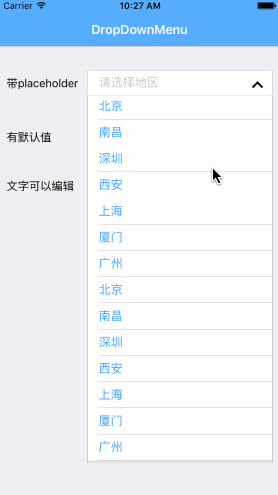
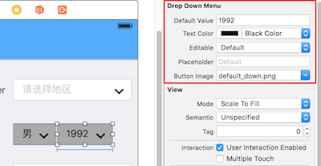

[](LICENSE)&nbsp;
[]()&nbsp;

# ZHDropDownMenu

## 简介
用`swift`实现的一个方便、实用的下拉菜单控件，也可以用来实现
`ComboBox`的效果
## 效果演示

## 特色
 - 支持`Storyboard/Xib`可视化设置属性，所见即所得
 - 可以根据需要决定是否允许用户手动编辑文字
 - 下拉按钮的图片、字体、文本颜色、边框等属性可以自己设置，你可以定制出你自己需要的样式

## 安装

### Cocoapods

1. 在 Podfile 中添加 `pod "ZHDropDownMenu"`。
2. 执行 `pod install` 或 `pod update`。

### 手动安装

1. 下载 ZHDropDownMenu 文件夹内的所有内容。
2. 将 ZHDropDownMenu 文件夹添加(拖放)到你的工程。

##使用

1. 在storyboard中添加一个`View`然后设置Class为`ZHDropDownMenu`，然后选中它，在右边进行设置。



2. 在代码中设置它的其他属性

	```           
	menu.options = ["1992","1993","1994","1995","1996","1997","1998"]//设置下拉列表项数据
   menu.defaultValue = "1992" //设置默认值
   menu.editable = false //禁止编辑
   menu.showBorder = false //不显示边框
   menu.delegate = self //设置代理
   ```
   
   
3. 实现协议中的回调方法

	```    
	//选择完后回调
    func dropDownMenu(menu: ZHDropDownMenu!, didChoose index: Int) {
        print("\(menu) choosed at index \(index)")
    }
    
    //编辑完成后回调
    func dropDownMenu(menu: ZHDropDownMenu!, didInput text: String!) {
        print("\(menu) input text \(text)")
    }
    ```


## 系统要求
该项目最低支持 iOS 8.0。


## 许可证
`DropDownMenu` 使用 MIT 许可证，详情见 LICENSE 文件。

